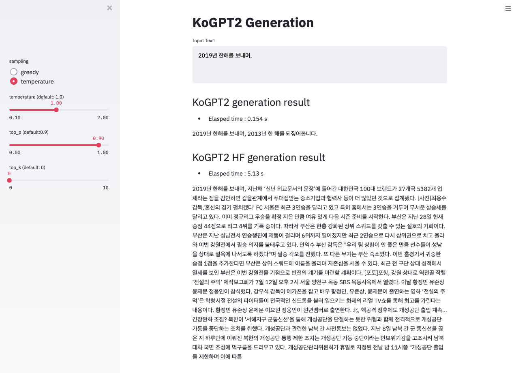

## This repository is for running inference server for korean GPT models(KoGPT2, HuggingFace gpt2)

### Build container image
```
cd docker
./build.sh
```
### download model & tokenizer
```
# tokenizer
wget --no-check-certificate 'https://docs.google.com/uc?export=download&id=<<tokenizer_download_path_id>>' -O tokenizer/kogpt2_news_wiki_ko_cased_818bfa919d.spiece

# model file
file_id="<model_download_path_id>"
file_name="model/pt_model/model_file.zip"
curl -sc /tmp/cookie "https://drive.google.com/uc?export=download&id=${file_id}" > /dev/null
code="$(awk '/_warning_/ {print $NF}' /tmp/cookie)"
curl -Lb /tmp/cookie "https://drive.google.com/uc?export=download&confirm=${code}&id=${file_id}" -o ${file_name}
unzip ${file_name} -d model/pt_model

```

### Run inference flask server (docker.run.sh) with docker container
```
./docker.run.modelAPI.sh
```

## Run streamlit
```
./docker/docker.run.streamlit.sh
```


### Reference
> https://github.com/SKT-AI/KoGPT2
> https://github.com/gyunggyung/KoGPT2-FineTuning
